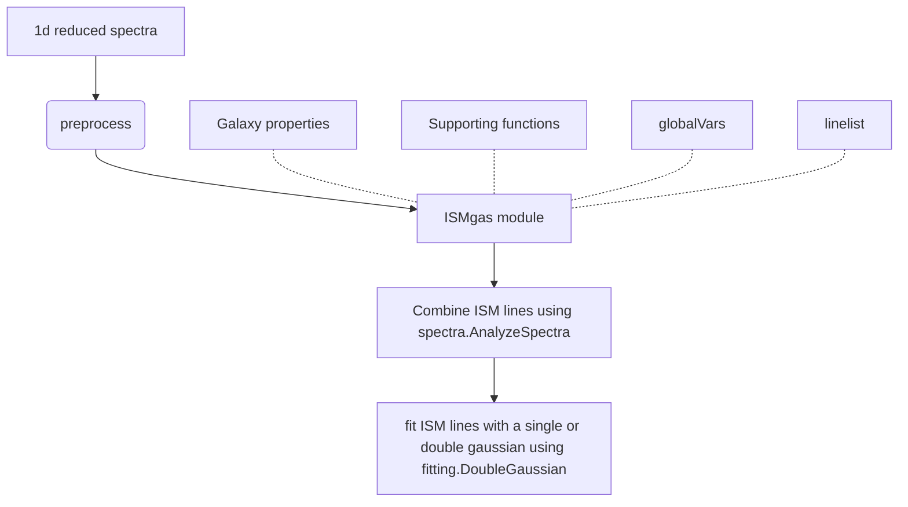

### Module flowchart 

```mermaid
flowchart TD
    spectra[1d reduced spectra] --> preprocess(preprocess)
    preprocess --> ISMgas[ISMgas module]
    ISMgas --> combine[Combine ISM lines using spectra.AnalyzeSpectra]
    combine --> fitting[fit ISM lines with a single or double gaussian using fitting.DoubleGaussian]
    GalaxyProps[Galaxy properties] -.- ISMgas
    Support[Supporting functions] -.- ISMgas
    global[globalVars] -.- ISMgas
    linelist[linelist] -.- ISMgas
```